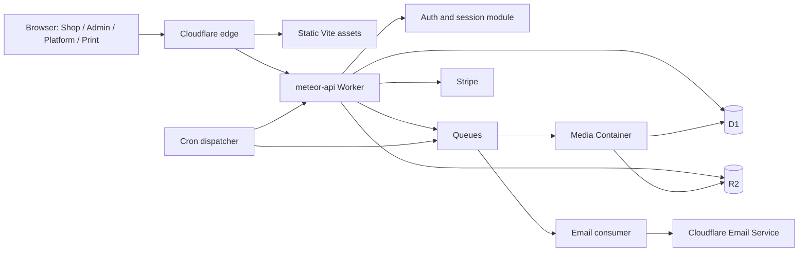

# Firebase to Cloudflare migration plan

**Project:** Chopshop / Meteor  
**Plan date:** 2026-08-15  
**Migration shape:** Fresh start. There are no customer shops, products, orders, customers, or production files that must be imported.  
**Status:** Planning only. No Cloudflare resources have been created and no application code has been changed by this document.

## Executive decision

Migrate now, before customer data exists.

The target should not reproduce the current Firebase topology one function at a time. It should collapse the backend into a small number of independently testable Cloudflare deployment units:

1. One modular API Worker for HTTP APIs, authentication, authorization, Stripe, admin, shop, platform, and print operations.
2. One static web deployment serving the existing Vite application on the four surfaces.
3. One D1 database per environment.
4. Private R2 buckets for public media and protected production assets.
5. Cloudflare Queues for email, commerce, print, and media events.
6. One scheduled dispatcher for maintenance jobs.
7. One scale-to-zero Cloudflare Container for the existing Sharp and FFmpeg/FFprobe workloads that cannot run inside Workers.

This removes Firebase Hosting, Firebase Auth, Firestore, Storage, and all Firebase Functions. It does **not** remove server-side code: the existing 75 Firebase function entry points become routes, consumers, and scheduled jobs inside a much smaller Cloudflare deployment surface.

The realistic target is:

- **18–30 elapsed agent-hours** with parallel work for a first viable cutover.
- **37–59 serial agent-hours** if done by one agent in sequence.
- One intensive 24-hour session is plausible for minimum viable parity because no data migration is required.
- A separate 8–16 hour hardening and cutover wave is the safer production standard.

The migration is only complete when the security and fulfilment invariants in this document pass against Cloudflare. Feature parity alone is not enough.

## Non-negotiable decisions

### 1. Use separate Cloudflare accounts for real environment isolation

Do not rely only on naming conventions inside one Cloudflare account.

Recommended structure:

| Account | Contains | Access |
|---|---|---|
| `Meteor Production` | Production zones, Workers, D1, R2, Queues, secrets, email, logs | Smallest possible production operator group and production-only API tokens |
| Personal Cloudflare account (`MeteorShop Non-Production`) | Local remote resources, preview, test, staging, development email | Developers and agents using non-production credentials |

Cloudflare resources are account-scoped. Separate accounts therefore provide the strongest practical boundary for API tokens, resource bindings, billing, and accidental deployment. Both accounts can remain under the same Cloudflare login or organization.

Within each account, still prefix resources consistently:

- `meteorshop-prod-*`
- `meteorshop-stg-*`
- `meteorshop-dev-*` only where a shared development resource is actually necessary

Never use a Global API Key. Use resource-scoped API tokens and separate deployment credentials per environment.

The personal account is the initial build target. The production account does not need to exist until the staging system is ready for a cutover rehearsal. Resources are redeployed from version-controlled configuration into production; they are not manually transferred between accounts.

### 2. One shared D1 database per environment, not one database per shop

Start with:

- `meteorshop-prod-db`
- `meteorshop-stg-db`

Every tenant-owned table must contain an immutable `shop_id`. All tenant reads and writes go through a repository/service layer that requires a trusted tenant context. Composite indexes and uniqueness constraints must include `shop_id` whenever identity is tenant-relative.

D1 bindings are not exposed directly to browsers, so database-level RLS is not required. That does **not** make tenant authorization obsolete. The API Worker is the database security boundary and every query still needs an explicit tenant scope.

Do not create one D1 database per shop initially. Platform reporting, Stripe reconciliation, DAC7, cross-shop operator workflows, and dynamic bindings would become unnecessarily complicated. Revisit sharding only if real measurements approach D1's per-database size or single-writer limits.

### 3. Cloudflare Access is not the customer authentication system

Cloudflare Access is useful as an optional second perimeter for the Platform surface, but it is primarily workforce/resource access. It does not replace Firebase Auth for storefront customers, shop owners, printers, and platform roles.

Recommended application identity layer:

- Better Auth, pinned to an exact reviewed version, running inside the API Worker. Better Auth documents native D1 support in its [1.5 release notes](https://better-auth.com/blog/1-5); the adapter still remains our dependency and responsibility, not a Cloudflare-managed identity service.
- D1-backed users, identities, sessions, verification tokens, reset tokens, and optional MFA/passkeys.
- Secure, HttpOnly, host-scoped cookies with distinct names for Platform, Admin, Print, and Storefront customer sessions.
- Server-derived role and shop membership on every request.
- Cloudflare Access may later protect `platform.*` in addition to application authentication.

The authentication adapter must be isolated behind application-owned interfaces. This prevents the frontend from becoming tightly coupled to a second vendor SDK.

### 4. Cloudflare Email Service replaces SMTP/Resend only after a canary

Use Cloudflare Email Service for transactional mail through a Worker binding, with email jobs delivered from a queue. It removes ordinary SMTP/API credentials from application configuration.

However, it is a transactional email service—not a marketing platform—and the current service should be treated as a dependency that needs a deliverability canary. Keep the existing provider available as a rollback path until verification, password reset, order confirmation, printer notification, and admin notification messages have passed production-domain tests.

Cloudflare documents 3,000 included transactional messages per month on Workers Paid, then $0.35 per additional 1,000. The sending domain must be onboarded to Cloudflare DNS, and SPF/DKIM/DMARC and bounce handling must be verified. See [Email Service](https://developers.cloudflare.com/email-service/) and its [pricing](https://developers.cloudflare.com/email-service/platform/pricing/).

### 5. Sharp and FFmpeg require a Container

The current POD artwork processor uses Sharp. Social video generation uses FFmpeg/FFprobe and child processes. Cloudflare Workers' `node:child_process` implementation is a non-functional compatibility stub, so these paths cannot be moved unchanged into the Worker runtime. See Cloudflare's [Node.js compatibility documentation](https://developers.cloudflare.com/workers/runtime-apis/nodejs/).

Create one Cloudflare Container-backed media service:

- Queue-triggered, not publicly exposed.
- Reads source assets from private R2.
- Runs Sharp and FFmpeg/FFprobe.
- Writes versioned outputs to R2.
- Records deterministic job status and artifact metadata in D1.
- Scales to zero when idle.

Cloudflare Images may later optimize storefront delivery, but it does not replace the print-authoritative image pipeline or arbitrary video rendering.

## Current repository baseline

The migration begins from the post-security-wave repository state, not from the older audit revision.

| Area | Current state | Migration consequence |
|---|---|---|
| Frontend | React/Vite; same build deployed to Admin, Shop, Platform, and Print | Keep the application initially; replace Firebase access behind a client API layer |
| Hosting | Four Firebase Hosting targets | Replace with one versioned Cloudflare static deployment and four host routes |
| Functions | 75 deployed Firebase Functions on Node.js 22 | Collapse into API routes, queue consumers, one scheduler, and one media Container |
| Firestore | Named database `b8s-reseller-db`; 30+ domain collections | Design a relational D1 schema from domain invariants, not a document-for-table transcription |
| Frontend coupling | 133 files import Firebase modules; 105 import Firestore; 45 import Functions; 15 import Storage | Introduce application-owned adapters and migrate by domain/surface |
| Realtime | 17 `onSnapshot` usages | Replace most with bounded polling/query invalidation; reserve realtime for genuine presence needs |
| Storage | Firebase Storage with public and protected paths | Split public delivery media from protected originals, print files, and documents in R2 |
| Payments | Stripe PaymentIntents, Connect, refunds, webhooks, DAC7 | Preserve Stripe; move orchestration and idempotency to Worker + D1 |
| Email | SMTP-style orchestration and a durable print outbox | Queue all transactional email; deliver through Cloudflare Email Service after canary |
| Native media | Sharp, FFmpeg, FFprobe | Container workload; not Worker code |

## Target architecture

### Deployment units

| Unit | Responsibility | Deploy frequency |
|---|---|---|
| `meteorshop-{env}-web` | Vite assets, SPA routing, security headers, four hostnames | UI releases |
| `meteorshop-{env}-api` | All HTTP API routes, auth, authorization, business services, Stripe webhooks | Backend releases |
| `meteorshop-{env}-jobs` | Queue consumers and scheduled dispatcher; may begin in the API Worker if limits permit | Backend/job releases |
| `meteorshop-{env}-media` | Sharp and FFmpeg/FFprobe processing | Media pipeline releases only |

Start with the API and jobs handlers in one Worker project if that produces a simpler safe deploy. Split them only if failure domains, bindings, or release cadence justify it. The goal is a small number of coherent units—not a fixed number of Workers.

### Surface and cookie isolation

| Surface | Example host | Cookie | Audience |
|---|---|---|---|
| Platform | `platform.meteorpr.*` | `__Host-meteor_platform` | Platform operators only |
| Shop Admin | `admin.meteorpr.*` | `__Host-meteor_admin` | Shop users |
| Storefront | shop/custom domain | `__Host-meteor_shop` | Public and customer accounts |
| Print | `print.meteorpr.*` | `__Host-meteor_print` | Print-shop operators |
| API | `api.meteorpr.*` or same-origin `/api` | No broad domain cookie | All surfaces through strict origin and session checks |

Prefer same-origin `/api` routing per surface when practical. It simplifies cookies, CSRF, and CORS. Cookies must be `Secure`, `HttpOnly`, path `/`, and have no `Domain` attribute. Use an explicit CSRF defence for state-changing cookie-authenticated requests.

## Firebase-to-Cloudflare service map

| Firebase capability | Cloudflare target | Important design note |
|---|---|---|
| Firebase Hosting | Workers Static Assets or Pages | Use immutable hashed assets, no-cache HTML, SPA fallback, CSP/security headers |
| Firebase Auth | Better Auth + D1 | Cloudflare Access is optional defence-in-depth for Platform only |
| Firestore client SDK | API Worker + D1 | Browser never receives a D1 binding or runs arbitrary database queries |
| Firestore rules | API authorization + repository invariants + D1 constraints | Treat authorization tests as the replacement for rules tests |
| Firestore triggers | Explicit D1 transaction + Queue event/outbox | No hidden side effect should depend on a database write trigger |
| Cloud Functions HTTP/callable | Typed API routes | One request envelope and error model across all clients |
| Scheduled Functions | Cron dispatcher | One schedule can enqueue named jobs; jobs remain idempotent |
| Firebase Storage | R2 | Private by default; public projection or signed delivery only |
| Storage triggers | R2 event notification + Queue | Consumers must be idempotent and tolerate duplicates |
| App Check | Turnstile + rate limits + origin/session checks | Bot protection is not authorization |
| Firebase Emulator tests | Local Worker/D1/R2/Queue integration suite | Run migrations and tests in an isolated local database |
| Functions config/env | Worker secrets and Secrets Store | Rotate current SMTP/admin secrets during migration |
| Firestore realtime | Query cache/polling; optional Durable Object | Do not rebuild realtime where the task does not need it |

## Application module map

The 75 Firebase exports should be grouped by domain. Do not create 75 Cloudflare Workers.

| Module | Existing responsibilities | Cloudflare shape |
|---|---|---|
| Identity and access | Verification, password reset, claims, user provisioning, customer deletion, admin/print users | Auth callbacks plus `/identity/*` routes and audited services |
| Commerce and checkout | PaymentIntent, Stripe webhook, recovery, discounts, refunds, Connect | `/commerce/*`, `/stripe/webhook`, D1 transactions, commerce queue |
| Orders and fulfilment | B2B order, completion, status, print queue/job/download/export | `/orders/*`, `/print/*`, immutable production snapshots |
| POD and media | Artwork processing, mappings, social video/copy | API submission + media queue + Container |
| Email and notifications | Order, status, affiliate, verification, credentials, print outbox | Email queue with resource-derived recipients and templates |
| Shops and platform | Shop commission, Connect state, platform users/settings, handoff | `/platform/*` and `/shops/*`, explicit audited operator context |
| Affiliate and campaigns | Applications, clicks, commission reversal, campaign state | `/affiliate/*`, `/campaigns/*`, transactionally emitted events |
| Compliance | DAC7, withdrawal, correction/export | `/compliance/*`, strict platform/self scopes and immutable audit trail |
| Migration/import | Shopify/Woo import, metadata scrape | Queue-backed import jobs with SSRF-safe fetch service |
| Maintenance | Abandoned checkouts, reviews, print notification sweep | One cron dispatcher enqueueing deterministic job types |

## D1 data model

Do not mechanically turn every Firestore collection into a table. Build the first schema around domain ownership, state machines, and immutable snapshots.

### Identity and tenancy

- `users`
- `auth_accounts`
- `sessions`
- `verification_tokens`
- `password_reset_tokens`
- `shops`
- `shop_domains`
- `shop_memberships`
- `shop_entitlements`
- `print_shop_memberships`
- `platform_roles`
- `impersonation_sessions`
- `audit_events`

### Catalogue and Design Studio

- `products`
- `product_variants`
- `product_publications`
- `product_media`
- `pod_artworks`
- `pod_artwork_versions`
- `pod_mappings`
- `pod_product_costs`
- `collections`
- `pages`

### Commerce and customers

- `customers`
- `customer_addresses`
- `checkouts`
- `checkout_items`
- `orders`
- `order_items`
- `order_consents`
- `payments`
- `refunds`
- `discount_codes`
- `discount_redemptions`
- `shipping_methods`
- `pickup_locations`

### Production and asynchronous work

- `production_jobs`
- `production_job_items`
- `event_outbox`
- `email_deliveries`
- `media_jobs`
- `job_attempts`
- `idempotency_keys`

### Growth, compliance, and operations

- Affiliate, campaign, lead, review, DAC7, withdrawal, and migration tables grouped by their bounded contexts.
- Prefer append-only event/history tables for finance, fulfilment, compliance, and impersonation.
- Public storefront projections must be separate from private catalogue/cost data, either through projection tables or strictly field-selected API responses.

### Mandatory database invariants

1. `shop_id` is immutable outside an explicit platform transfer workflow.
2. A membership references one user, one shop, and a constrained role.
3. Tenant-relative identifiers and SKUs use composite uniqueness including `shop_id`.
4. Stripe event ID, PaymentIntent ID, refund ID, and external idempotency key are unique.
5. POD mapping uniqueness includes shop, SKU/prefix, and placement.
6. Artwork versions and paid order production snapshots are immutable.
7. Refund totals cannot exceed captured totals.
8. State changes use compare-and-set transactions and append history.
9. Public projections contain no cost, wholesale, internal routing, or draft data.
10. Hard deletion is prohibited for financial, production, compliance, and security audit records.

## Security invariants carried into Cloudflare

The migration must preserve the lessons from the full audit and the completed fix waves.

### Tenant boundary

- Never accept `shop_id` as authority from a request body.
- Resolve tenant from the host, authenticated membership, or an explicit audited platform context.
- Every tenant repository method takes that resolved context.
- Platform cross-tenant operations require an active reasoned impersonation/support session where applicable.
- Test foreign object IDs and attempted re-homing for every domain.

### Checkout and payment

- Load product, variant, price, availability, shipping, and fulfilment identity on the server.
- Derive order SKU, name, image, and print mapping from server data.
- Bind products to the resolved shop and published B2C projection.
- Validate pickup location and personalized-goods consent server-side.
- Use a checkout idempotency key and Stripe idempotency key.
- Verify Stripe signatures from the raw request body.
- Treat webhook retries as normal and harmless.

### Orders and print

- Financial and production fields are server-owned.
- Paid orders snapshot exact artwork version, path, placement, variant, and production data.
- Every POD line must resolve before a job becomes producible.
- Status transitions are transactional and compare the expected previous state.
- Queue and email delivery are at-least-once; D1 idempotency makes the effects once-only.
- Private R2 objects are delivered only after order, shop, role, and artifact validation.

### Identity and email

- Verification proves control of the account email; tokens are hashed, single-use, expiring, and never returned or logged.
- Password resets follow the same rules.
- Email endpoints accept resource IDs, not arbitrary recipient/template content.
- No secret, verification code, customer object, or payment payload appears in logs.
- Platform and printer accounts use invitation/setup flows rather than displayed passwords.

### Edge and API

- Strict allowed origins per surface.
- Host-scoped session cookies and CSRF protection.
- Turnstile on abuse-prone anonymous flows.
- Distributed rate limits for checkout, login, verification, reset, leads, reviews, affiliate clicks, imports, and scraping.
- Request size, file type, file size, timeout, redirect, and SSRF controls.
- Enforced CSP after a report-only observation period.
- Structured logs with redaction, request IDs, actor/shop context, and bounded retention.

## R2 storage design

Recommended production buckets:

| Bucket | Visibility | Contents |
|---|---|---|
| `meteorshop-prod-public` | Delivered through controlled public/custom domain | Published product images, public shop branding, public page media |
| `meteorshop-prod-private` | Worker/Container only | Artwork originals, print-ready files, customer documents, order attachments, exports |
| `meteorshop-prod-temp` | Private with lifecycle expiry | Upload staging, render intermediates, imports |

Object keys must begin with stable ownership and object identity, for example `shops/{shop_id}/...`, but path naming is not authorization. Store canonical bucket/key metadata in D1 and validate it before every signed or proxied delivery.

Use versioned keys for print artifacts. Never overwrite the object referenced by an already-paid order.

Cloudflare R2 currently includes 10 GB-month of Standard storage, 1 million Class A operations, and 10 million Class B operations monthly, with no egress charge. See [R2 pricing](https://developers.cloudflare.com/r2/pricing/).

## Queue and job design

Recommended queues:

| Queue | Events |
|---|---|
| `meteorshop-{env}-commerce` | Paid order, refund, commission, production-ready, review eligibility |
| `meteorshop-{env}-email` | Verification, reset, order, print, admin, affiliate transactional mail |
| `meteorshop-{env}-media-jobs` | Artwork validation/rendering, mockups, social video, image derivatives |
| `meteorshop-{env}-imports` | Shopify/Woo import and metadata extraction |

Rules:

- Every message has a deterministic event ID.
- Consumers record a claim/lease or unique processed-event row before side effects.
- Retries use bounded exponential backoff.
- Every queue has a dead-letter queue and an operator-visible failure state.
- Email and media jobs retain provider/artifact result identifiers.
- No critical effect depends solely on a log message.

Replace Firestore triggers with an explicit transaction-outbox pattern: the D1 state change and outbox record are committed together, then a dispatcher sends the queue message. This preserves the completed production-notification reliability work without depending on hidden database triggers.

## Realtime replacement

Do not rebuild all 17 Firestore listeners as WebSockets.

| Current listener type | Replacement |
|---|---|
| Order confirmation after checkout | Poll every 2–3 seconds with a hard timeout, then show a recoverable support/status state |
| Admin tables and dashboards | Query caching, invalidate after writes, optional 10–30 second background refresh |
| Campaign/ambassador/dining activity | Query caching and refresh-on-focus; short polling only while the page is active |
| Design Studio processing | Poll job status or use Server-Sent Events if it materially improves the wait experience |
| Admin presence | Remove initially, or later use one Durable Object/WebSocket room if the feature is genuinely valuable |

## Migration waves

Each wave ends with a testable gate. Do not wait until final cutover to discover that a business invariant was lost.

### Wave 0 — Freeze and executable baseline (1–2 hours)

- Record the exact Firebase revision and deployed function list.
- Freeze unrelated feature work or require all concurrent changes to land through one integration branch.
- Preserve the full isolation/security suite as platform-neutral acceptance specifications.
- Catalogue environment variables and secrets without copying secret values into documentation.
- Record Stripe webhook/event behavior and all four host routing modes.
- Confirm that production contains no customer state requiring export.

**Gate:** clean revision, green current tests, explicit zero-data assertion, and a rollback tag.

### Wave 1 — Cloudflare foundation and isolation (2–3 hours)

- Designate the existing personal Cloudflare account as `MeteorShop Non-Production`.
- Reserve the separate `MeteorShop Production` account as a pre-cutover requirement; it does not need to be created during initial staging work.
- Authenticate local Wrangler access to the non-production account; create a scoped account-owned CI token only when CI deployment is introduced.
- Establish the Worker/static project, environment bindings, naming rules, and resource manifest.
- Create local and staging D1 databases, R2 buckets, Queues, dead-letter queues, and secrets.
- Generate binding types and validate local development.
- Configure preview/staging hosts; do not touch production DNS.

**Gate:** a versioned staging deployment can serve the SPA and a health route without access to production resources.

### Wave 2 — D1 schema and application authentication (4–6 hours)

- Write ordered D1 migrations and seed only platform/bootstrap configuration.
- Add the tenant repository boundary and authorization policy layer.
- Integrate Better Auth behind an application-owned identity service.
- Implement separate host-scoped sessions for Platform, Admin, Print, and Storefront.
- Implement verification, reset, invitations, logout/revocation, and role/shop memberships.
- Add optional Cloudflare Access only to staging Platform after app auth works.

**Gate:** cross-surface cookie tests, cross-tenant denial tests, verification/reset tests, and audited platform access all pass.

### Wave 3 — Catalogue, shops, and frontend data adapter (6–10 hours)

- Implement shops, domains, memberships, entitlements, products, variants, pages, collections, and public projections.
- Create a typed client API layer that contains no Firebase imports.
- Migrate read-heavy storefront and admin flows first.
- Replace snapshot listeners with query cache/polling according to the realtime table.
- Implement R2 upload grants/finalization and protected downloads.
- Port Design Studio metadata and mapping workflows, leaving heavy processing queued.

**Gate:** one new staging shop can be provisioned, designed, published, viewed publicly, edited, and isolated from a second test shop.

### Wave 4 — Commerce, Stripe, orders, and print (6–8 hours)

- Port server-authoritative checkout pricing and validation.
- Port Stripe PaymentIntent creation, webhook verification, Connect, refunds, and reconciliation.
- Implement immutable order and production snapshots.
- Port B2B order state, print queue, print job, downloads, and transactional transitions.
- Add outbox/queue events for production readiness and customer/admin notifications.
- Port DAC7 and withdrawal flows only after core monetary flows pass.

**Gate:** adversarial checkout suite, duplicate webhook suite, partial refund suite, B2B paid-state suite, and complete POD resolution suite all pass.

### Wave 5 — Email, media, imports, and maintenance jobs (6–10 hours)

- Onboard the sending domain to Cloudflare Email Service.
- Port resource-derived email templates and queue delivery.
- Build the media Container with the current pinned Sharp/FFmpeg behavior.
- Port versioned artwork processing, print files, mockups, and social video.
- Port imports with SSRF-safe network controls.
- Port cron jobs through the scheduled dispatcher.
- Add dead-letter visibility, retry controls, and alerts.

**Gate:** real-domain email canary, golden-image artwork comparison, video smoke test, retry/idempotency tests, and failed-job operator recovery all pass.

### Wave 6 — Remove Firebase from the frontend (8–12 hours, overlaps Waves 3–5)

- Migrate each of the 133 Firebase-importing frontend files by domain.
- Remove Firestore, Functions, Storage, and Auth SDK usage only after each replacement test passes.
- Split surface entry points or lazy-load operator-only code so storefront users do not download Admin/Platform/Print bundles.
- Remove Firebase environment variables and CSP endpoints.
- Keep a temporary build-time detector that fails if application code imports Firebase.

**Gate:** zero Firebase imports in runtime source, four surface builds/routes pass, and bundle boundaries are verified.

### Wave 7 — Staging soak and cutover (4–8 hours)

- Run the full test matrix against staging Cloudflare resources.
- Create multiple shops and intentionally attempt cross-tenant access.
- Exercise checkout through payment, order, print, email, refund, and withdrawal.
- Run accessibility and responsive smoke tests on all four surfaces.
- Confirm logs contain no secrets or PII payloads.
- Configure production resources and secrets through reviewed manifests.
- Lower DNS TTL before the cutover window.
- Switch hosts only after an explicit go decision.

**Gate:** signed cutover checklist, production smoke suite, Stripe webhook receipt, email receipt, and rollback route verified.

### Wave 8 — Firebase retirement (after 7 stable days)

- Keep Firebase read-only/undeployed as the rollback target during the observation window.
- Disable Firebase scheduled jobs and functions only after Cloudflare jobs are confirmed active.
- Revoke Firebase runtime and CI credentials.
- Remove obsolete SMTP/admin secrets and rotate any credential previously exposed as ordinary function environment variables.
- Delete Firebase resources only after a separately approved retention decision.
- Update architecture, operations, incident, onboarding, and deployment documentation.

**Gate:** seven days of stable production metrics, no pending rollback, and explicit deletion approval.

## Validation matrix

| Area | Required evidence |
|---|---|
| Tenancy | Foreign shop IDs denied across every domain; `shop_id` cannot be changed by tenant actors |
| Auth | Verification cannot succeed without mailbox token; sessions isolated by surface; revoked sessions fail |
| Catalogue | Draft/private/cost/B2B fields never appear in public API responses |
| Checkout | Server derives product, price, variant, SKU, shipping, pickup, consent, and shop |
| Stripe | Raw-body signatures, unique events, idempotent PaymentIntents, safe retries |
| Refunds | Multiple partial refunds, cumulative total, proportional policy, duplicate event safety |
| Print | Every line resolves; exact paid artwork version survives later edits; concurrent transitions cannot race |
| Storage | Protected objects cannot be listed or fetched by guessed keys; paid artifacts cannot be client-deleted |
| Email | Recipient/template derived from resource; queue retry; no duplicate concurrent send; failure visible |
| Media | Golden input/output comparison for Sharp; FFmpeg/FFprobe smoke; retry does not overwrite paid version |
| Abuse | Distributed limits and Turnstile on anonymous high-risk routes |
| Privacy | Redacted structured logs; order confirmation uses expiring capability or authenticated proof |
| UX | All four surfaces have loading, error, retry, empty, blocked, and success states for migrated flows |
| Deployment | Staging/prod tokens cannot access each other's account; rollback version documented and tested |

## Deployment and rollback model

### Normal deployment order

1. Apply backward-compatible D1 migrations.
2. Deploy queue consumers/scheduler if their event contract changes.
3. Upload the API Worker version without routing all traffic to it.
4. Run smoke and migration checks.
5. Promote the API version.
6. Deploy versioned static assets and HTML.
7. Run production smoke checks across all four hosts.

Database migrations should use expand/contract changes. Never deploy a destructive schema change in the same release that first stops using the old field/table.

### Rollback

- Worker/static rollback: promote the last known-good Cloudflare version.
- Database rollback: application rollback must tolerate the expanded schema; avoid down-migrations during incidents.
- Cutover rollback: restore the Firebase DNS/host route during the seven-day observation window.
- Email rollback: switch the queue consumer to the retained transactional provider.
- Media rollback: pause the media queue and restore the last compatible Container image.
- Stripe rollback: ensure only one webhook destination performs side effects; disable the failed destination before re-enabling the previous one.

## Cost expectation

For this application's expected pre-customer and early-customer traffic, Cloudflare should not reach “real money” from infrastructure usage for a long time.

### Expected early production baseline

| Service | Likely early monthly cost |
|---|---:|
| Production Workers Paid account | $5 minimum |
| Non-production account | $0 on Free where possible, or another $5 if Paid features are required |
| Static assets | $0 usage charge under current Workers pricing |
| D1 | Likely within included Paid allowance |
| R2 | Likely within included storage/operations initially |
| Queues | Likely within included/low usage |
| Transactional email | First 3,000 messages included on Workers Paid |
| Media Container | Often within the current included Paid allocation at low volume; monitor renders rather than assume |

Expected infrastructure baseline is roughly **$5–$15/month**, excluding domains, Stripe fees, optional Cloudflare Images, observability vendors, and unusually heavy video/image rendering. Container usage has its own compute allocation and overage model; verify it against the current [Containers pricing](https://developers.cloudflare.com/containers/pricing/) before enabling a high-volume render path.

Cloudflare Workers Paid currently has a $5 account minimum including 10 million dynamic requests and 30 million CPU milliseconds per month; static asset requests are free and unlimited. Additional usage is $0.30 per million requests and $0.02 per million CPU milliseconds. See [Workers pricing](https://developers.cloudflare.com/workers/platform/pricing/). D1 Paid currently includes 25 billion rows read, 50 million rows written, and 5 GB stored per month; see [D1 pricing](https://developers.cloudflare.com/d1/platform/pricing/) and [D1 limits](https://developers.cloudflare.com/d1/platform/limits/).

The first cost pressure is more likely to be media CPU, email volume, logs/observability, or poorly indexed D1 reads—not ordinary storefront hosting. Add billing alerts and CPU limits before production traffic.

## Human/owner checkpoints

The agents can perform most implementation and verification, but these actions require account ownership, credentials, or an explicit production decision:

1. Create or approve the two Cloudflare accounts and membership model.
2. Approve scoped API tokens and production secret entry.
3. Move/onboard DNS zones and email DNS records.
4. Approve Better Auth as the application identity dependency.
5. Configure or approve Stripe webhook endpoints and secrets.
6. Perform the final production DNS cutover decision.
7. Approve irreversible Firebase resource deletion after the rollback window.

These checkpoints can be prepared in advance so the implementation run is not interrupted.

## Critical risks and controls

| Risk | Control |
|---|---|
| Reopening fixed security bugs during rewrite | Treat current adversarial tests/invariants as acceptance criteria before parity is declared |
| D1 query bottleneck or oversized database | Index deliberately, benchmark real queries, keep media outside D1, monitor query plans and size |
| Authentication dependency maturity | Pin exact version, own the adapter boundary, test migrations, retain upgrade/security process |
| Email service availability/deliverability | Canary with real domain and retain provider rollback until stable |
| Sharp/FFmpeg incompatibility in Workers | Container from the start; golden-file tests |
| Queue duplicate delivery | Deterministic IDs, unique D1 constraints, claims/leases, DLQ |
| Account-root resource confusion | Separate prod/non-prod accounts, scoped tokens, manifests, explicit resource IDs |
| Big-bang frontend regression | Migrate by domain behind one client API and keep surface-level acceptance tests |
| Two systems processing Stripe events | One active side-effect owner at a time; explicit webhook cutover procedure |
| 24-hour schedule drives unsafe shortcuts | Define minimum viable parity, preserve hard gates, defer non-critical features rather than security controls |

## Scope controls for the 24-hour sprint

### Must be in the first cutover

- Four surfaces and correct host routing.
- Application authentication and roles.
- Shop provisioning and tenant isolation.
- Catalogue, public projection, Design Studio publish/mapping.
- Checkout, Stripe webhook, orders, refunds, print production.
- Private R2 assets and print downloads.
- Verification/reset/order/print transactional email.
- Sharp artwork pipeline.
- Durable queues/outbox, idempotency, rate limits, and critical audit logs.
- Full security and commerce acceptance suite.

### Can be deferred if time becomes tight

- Admin presence/realtime.
- Social video generation, if not required for first customer onboarding.
- Shopify/Woo imports for a fresh-start launch.
- Advanced campaign/dining/ambassador realtime refresh.
- Cloudflare Images optimization.
- Optional Cloudflare Access perimeter.
- Non-critical dashboards and historical aggregation conveniences.

Deferral must remove or visibly disable the feature. It must not leave a control that appears to work while calling Firebase or silently failing.

## Definition of done

The migration is done only when all of the following are true:

- [ ] Production and non-production are isolated in separate Cloudflare accounts.
- [ ] No runtime source imports Firebase packages.
- [ ] No browser can access D1 or private R2 without an authorized API route.
- [ ] All four surfaces authenticate and isolate sessions correctly.
- [ ] Two staging shops pass the complete cross-tenant adversarial suite.
- [ ] A product can travel from Design Studio to storefront checkout to immutable print job.
- [ ] Payment, duplicate webhook, refund, email, and queue retry tests pass.
- [ ] Sharp output matches approved golden fixtures; required FFmpeg paths pass or are explicitly deferred.
- [ ] Public projections expose no private catalogue or shop fields.
- [ ] Logs contain no credentials, tokens, raw payment payloads, or customer objects.
- [ ] Staging and production deployment credentials cannot cross accounts.
- [ ] Cloudflare deployment and rollback commands are documented and rehearsed.
- [ ] Production smoke tests pass after DNS cutover.
- [ ] Firebase remains available but inactive during the seven-day rollback window.
- [ ] Firebase credentials/resources are retired only through a separately approved cleanup.

## Recommended next action

Before implementation, produce three small companion artifacts from the live repository:

1. `CLOUDFLARE_FUNCTION_MAP.md` — every one of the 75 Firebase exports mapped to an API route, event, scheduled job, Container task, or intentional retirement.
2. `CLOUDFLARE_DATA_MODEL.md` — D1 tables, columns, constraints, indexes, state machines, and Firestore-to-domain mapping.
3. `CLOUDFLARE_CUTOVER_CHECKLIST.md` — exact account, DNS, Stripe, email, secrets, deploy, smoke, and rollback commands with secrets redacted.

Then execute Waves 0–2 first. They settle isolation, schema, and auth—the decisions that would be expensive to reverse after the remaining modules are ported.
